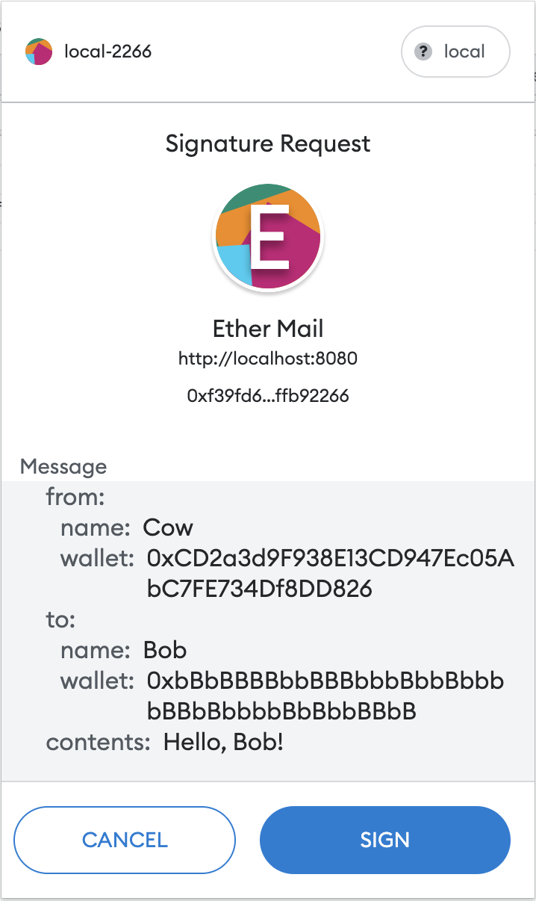
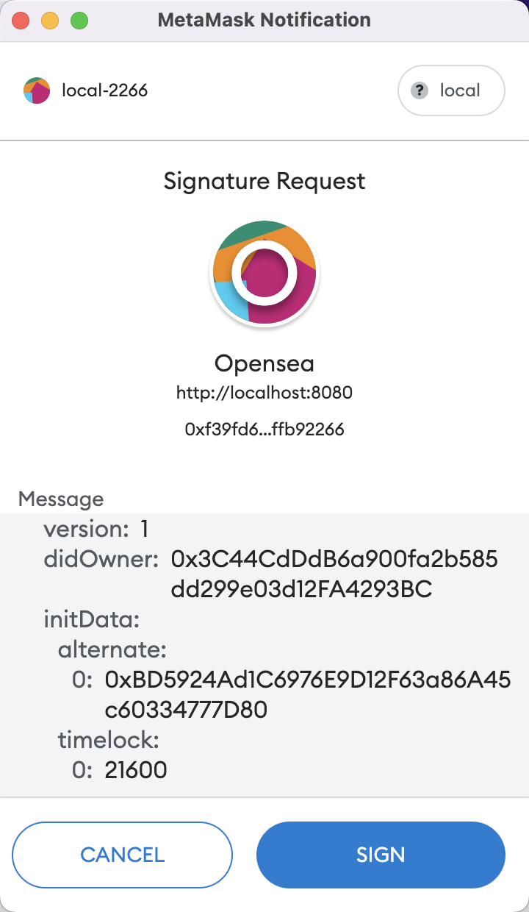

# Solidity Sign off-chain & Verify on-chain (EIP191 and EIP721)

This is a project which signs message off-chain and verifies signature on-chain inside Solidity code.


# Prerequisites

### Project setup
```
npm install
```

### Compiles and hot-reloads for development
```
npm run serve
```

Now, you're ready to open http://localhost:8080/ on Chrome browser, and you can run it step by step for a clearly understanding.

### Compiles and minifies for production
```
npm run build
```


# EIP712





<br/>
<br/>

# EIP191 

### 1. Connect With MetaMask
```
connectToMetamask: async function () {
    if (window.ethereum != undefined) {
        let accounts = await window.ethereum.enable();
        console.log("Your address: ", accounts);
        this.firstAccount = accounts[0]; 
    }
}
```
This will connect with MetaMask and get the account you selected from MetaMask Pop-up window.

<br/>
<br/>

### 2. Message hash
```
web3MessageHash: async function () {
    const info = this.getContractInfo();
    const rpcUrl = info[0]
    let web3 = new Web3(rpcUrl);
    
    const to = this.firstAccount;
    const _amount = 123 * 1e18;
    const _message = "Yidian Metaverse";
    const _nonce = 12;

    let result = web3.utils.soliditySha3(to, _amount, _message, _nonce);
    // or
    // let result = web3.utils.soliditySha3({t: 'address', v: to}, {t: 'uint256', v: _amount}, {t: 'string', v: _message}, {t: 'uint256', v: _nonce});
    
    this.messageHash = result;
}
```
This method will generate a hash string from the data you want to pack, it's only done locally.

<br/>
<br/>

### 3. Sign message hash in use of your private key
```
MetaMaskSignedMsgHash: async function () {
    let result = await window.ethereum.request({ method: "personal_sign", params: [this.firstAccount, this.messageHash]});
    console.log("Signature=", result)
    this.signedMessageHash = result;
}
```
This method will generate data `sigature` by using MetaMask so that users know how do we use their private key.
or using a `account_sign` in web3.js
```
const web3 = new Web3(rpcUrl); 
const result2 = web3.eth.accounts.sign(this.messageHash, "your private key");
console.log("Signed Message hash in web3.js : ", result2)
```

<br/>
<br/>

### 4. Verify on Solidity
```
solVerify: async function () {
    const info = this.getContractInfo();
    const rpcUrl = info[0]
    const contractAddress = info[1]
    const contractAbi = info[2]

    const web3 = new Web3(rpcUrl);

    const to = this.firstAccount;
    const _amount = web3.utils.toHex(123 * 1e18);
    const _message = "Yidian Metaverse";
    const _nonce = 12;

    const myContract = new web3.eth.Contract(contractAbi, contractAddress);
    const result = await myContract.methods.verify(this.firstAccount, to, _amount, _message, _nonce, this.signedMessageHash).call();
    console.log("The Verification result：", result);
}
```


This is the PRC endpoint、contract address、and contract abi for the signature verification scenario.
```
getContractInfo: function () {
    const rpcUrl = "https://rinkeby.infura.io/v3/your-project-id";
    const contractAddress = "0xff0cC28F685b74AB46F724844B49Ff3E71eF65EC";

    const contractAbi = [{"inputs":[{"internalType":"bytes32","name":"_messageHash","type":"bytes32"}],"name":"getEthSignedMessageHash","outputs":[{"internalType":"bytes32","name":"","type":"bytes32"}],"stateMutability":"pure","type":"function"},{"inputs":[{"internalType":"address","name":"_to","type":"address"},{"internalType":"uint256","name":"_amount","type":"uint256"},{"internalType":"string","name":"_message","type":"string"},{"internalType":"uint256","name":"_nonce","type":"uint256"}],"name":"getMessageHash","outputs":[{"internalType":"bytes32","name":"","type":"bytes32"}],"stateMutability":"pure","type":"function"},{"inputs":[{"internalType":"bytes32","name":"_ethSignedMessageHash","type":"bytes32"},{"internalType":"bytes","name":"_signature","type":"bytes"}],"name":"recoverSigner","outputs":[{"internalType":"address","name":"","type":"address"}],"stateMutability":"pure","type":"function"},{"inputs":[{"internalType":"bytes","name":"sig","type":"bytes"}],"name":"splitSignature","outputs":[{"internalType":"bytes32","name":"r","type":"bytes32"},{"internalType":"bytes32","name":"s","type":"bytes32"},{"internalType":"uint8","name":"v","type":"uint8"}],"stateMutability":"pure","type":"function"},{"inputs":[{"internalType":"address","name":"_signer","type":"address"},{"internalType":"address","name":"_to","type":"address"},{"internalType":"uint256","name":"_amount","type":"uint256"},{"internalType":"string","name":"_message","type":"string"},{"internalType":"uint256","name":"_nonce","type":"uint256"},{"internalType":"bytes","name":"signature","type":"bytes"}],"name":"verify","outputs":[{"internalType":"bool","name":"","type":"bool"}],"stateMutability":"pure","type":"function"}];
    return [rpcUrl, contractAddress, contractAbi];
} 
```